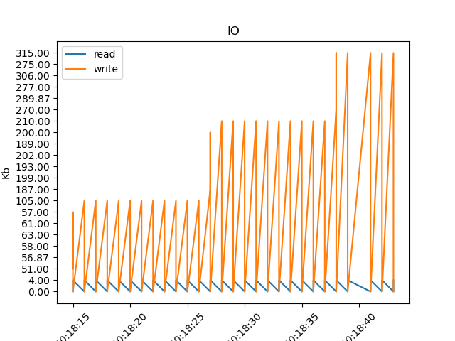

# Средства мониторинга в Линукс

## Задание
Oсновная цель лабораторной работы - знакомство с системными инструментами анализа производительности и поведения программ. Для этого предлагается для выданной по варианту программы выяснить следующую информацию:

1. Количество потоков создаваемое программой;
2. Список файлов и сетевых соединений с которыми работает программа
3. Карту памяти процесса;
4. Содержимое передаваемых по сети данных;

## Построить графики:
* Потребления программой cpu;
* Нагрузки генерируемой программой на подсистему ввода-вывода;
* Нагрузки генерируемой программой на сетевую подсистему.
* Смены состояния исполнения потоков;

# Реализация

Программа по варианту ```2778087```

Запускаем программу ```./run```

Чтобы потом очистить всё от лишних файлов запустите: ```./clear``` и ```./clear_threads```

**Ouput**
```
25 processes were created.
275 different files programm use.
```

**Sent and received data from file sent_data:**
```
10:18:24.939218 (+     0.000043) recvfrom(8<socket:[50975]>, "dqgmlqjsetidinkidy", 1313, 0, NULL, NULL) = 18
10:18:24.939559 (+     0.000056) recvfrom(8<socket:[50975]>, "", 1313, 0, NULL, NULL) = 0
10:18:35.941176 (+     0.000233) recvfrom(7<socket:[54469]>, "dqgmlqjsetidinkidy", 1313, 0, NULL, NULL) = 18
10:18:35.941436 (+     0.000065) recvfrom(7<socket:[54469]>, "", 1313, 0, NULL, NULL) = 0
10:18:24.938773 (+     0.000148) sendto(6<socket:[50967]>, "dqgmlqjsetidinkidy", 18, 0, NULL, 0) = 18
10:18:35.940572 (+     0.000269) sendto(5<socket:[54465]>, "dqgmlqjsetidinkidy", 18, 0, NULL, 0) = 18
10:18:24.938889 (+     0.000048) sendto(7<socket:[50968]>, "dqgmlqjsetidinkidy", 18, 0, NULL, 0) = 18
10:18:35.940792 (+     0.000137) sendto(6<socket:[54467]>, "dqgmlqjsetidinkidy", 18, 0, NULL, 0) = 18
10:18:24.939297 (+     0.000040) recvfrom(9<socket:[50976]>, "dqgmlqjsetidinkidy", 1313, 0, NULL, NULL) = 18
10:18:24.939599 (+     0.000039) recvfrom(9<socket:[50976]>, "", 1313, 0, NULL, NULL) = 0
10:18:35.941505 (+     0.000068) recvfrom(8<socket:[54470]>, "dqgmlqjsetidinkidy", 1313, 0, NULL, NULL) = 18
10:18:35.941847 (+     0.000196) recvfrom(8<socket:[54470]>, "", 1313, 0, NULL, NULL) = 0
```

## Графики

### Потребления программой cpu

```
echo "$(date) :: $PNAME[$(pidof ${PNAME})] $(ps -C ${PNAME} -o %cpu  | tail -1)%" >> $LOG_FILE
```

### Потребления программой IO


```
sudo iotop -aobt >> io_log &
```

### Нагрузка на сеть


```
now=$(date +"%T")
cat /proc/$PID/net/dev 2>/dev/null | awk -v t=$now 'NR>2 {print t " " $2,$10}' >> $LOG_FILE
```

### Потоки создаваемые программой


```
now=$(date +"%T")
   count=$(ps -p "$2" -T -o state | grep -c R)
   echo "$now $count" >> "$1"
```

# Выводы
В этой лабораторной работе я ближе познакомилась со средствами мониторинга Линукс. 
